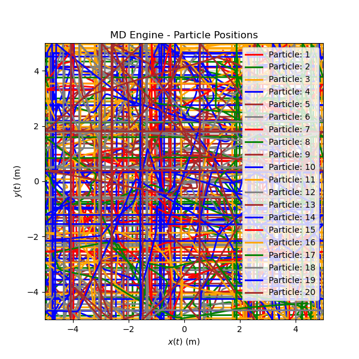

# Molecular Dynamics Engine

This project is a simple molecular dynamics simulation engine built for visualization of particle-particle interactions and how they evolve over time. The goal behind this is to focus on understanding how molecular dynamics engines run and function, with readable and easy to interpret code.

When you run this simulation, you'll get:
1) A static matplot showing particle motion and positions
2) An mp4 visualizing the movement of those particles
3) Access to numerical data for positions, velocities, energy, and temperature

## Visuals

The engine will generate a plot depicting particle positions which is saved as "Files/Particle_Positions.png"

The simulation generates a video animation automatically.  
By default, the animation is saved to: "Files/Particle_Animation.mp4"

<video src="Files/Particle_Animation.mp4" width="320" height="240" controls></video>

## Python Files

1) _ init _.py -  Marks a directory as a regular Python package and allows you to import its modules
2) initializer.py - Defines variables for the MD engine
3) forces.py - Calculates the Lennard Jones Force and Potential Energy for the MD Engine
4) wrapping.py - Wraps particle locations based on box_length bounds
5) integrator.py - Loops MD data to calculate position, velocity, and energy at each particle snapshot
6) visuals.py - Creates visuals projecting data from particle positions
7) md_engine.py - Calls all MD-related functions in order

8) main.py - Runs the MD engine with selected parameters

### Parameters

- kx : Spring constant for x position
- ky : Spring constant for y position
- mass : Mass of particle
- particles : Number of particles
- boltzmann : In the surroundings at given temperature
- gamma : Friction in system
- target_temp : Target temperature of system
- dt : Designated timestep
- total_time : Total runtime of system
- rand_position_scale : Scales the random initial position values of particles
- epsilon : Max strength of particle attraction
- lennard_sigma : Radius of particle
- D : Number of Dimensions  

